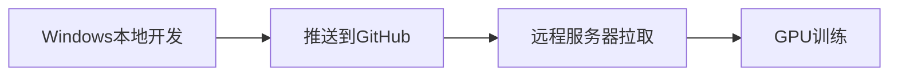
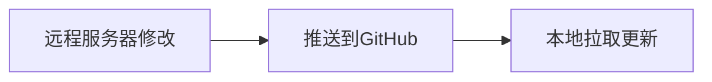
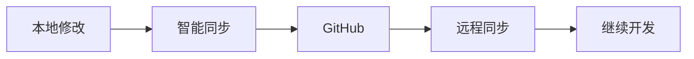

# 🤝 M2D 协作工作流指南

## 概述

本指南说明如何在本地Windows开发环境和远程GPU服务器之间进行高效的代码协作。

## 🔄 协作场景

### 场景1: 本地开发 → 远程训练


### 场景2: 远程开发 → 本地同步


### 场景3: 双向协作


## 🛠️ 可用脚本

### 基础脚本
- `sync_to_github.sh/.bat` - 推送本地代码到GitHub
- `update_from_github.sh/.bat` - 从GitHub拉取最新代码
- `smart_sync.sh/.bat` - 智能判断推送或拉取操作

### 辅助脚本
- `setup_github_auth.sh/.bat` - 配置GitHub认证
- `deploy_remote.sh` - 远程服务器部署

## 📋 工作流程

### 🚀 日常开发流程

#### 开始工作前
```bash
# 智能同步（推荐）
./deployment_scripts/smart_sync.sh

# 或手动检查更新
./deployment_scripts/update_from_github.sh
```

#### 完成开发后
```bash
# 智能同步（推荐）
./deployment_scripts/smart_sync.sh

# 或手动推送
./deployment_scripts/sync_to_github.sh
```

### 🎯 具体协作场景

#### 场景A: 本地开发完成，需要远程训练

**本地操作：**
```bash
# 1. 推送代码
./deployment_scripts/sync_to_github.sh

# 2. 记录commit信息（可选）
git log --oneline -3
```

**远程服务器操作：**
```bash
# 1. 拉取最新代码
git pull origin main

# 2. 或使用更新脚本
./deployment_scripts/update_from_github.sh

# 3. 开始训练
python scripts/train.py --epochs 100 --use_wandb
```

#### 场景B: 远程服务器调试完成，需要本地同步

**远程服务器操作：**
```bash
# 1. 提交远程修改
git add .
git commit -m "Fix training issues and optimize hyperparameters"

# 2. 推送到GitHub
git push origin main
```

**本地操作：**
```bash
# 1. 拉取远程更新
./deployment_scripts/update_from_github.sh

# 2. 检查更新内容
git log --oneline -5
git diff HEAD~1
```

#### 场景C: 双方同时开发（冲突处理）

**当智能同步检测到分叉时：**

1. **自动处理（推荐）**：
   ```bash
   ./deployment_scripts/smart_sync.sh
   # 脚本会自动先拉取再推送
   ```

2. **手动处理**：
   ```bash
   # 1. 暂存本地更改
   git stash push -m "Local changes before merge"
   
   # 2. 拉取远程更新
   git pull origin main
   
   # 3. 恢复本地更改
   git stash pop
   
   # 4. 解决冲突（如有）
   git add .
   git commit -m "Resolve merge conflicts"
   
   # 5. 推送合并结果
   git push origin main
   ```

## 🔧 高级功能

### 智能同步分析

智能同步脚本会分析以下状态：

1. **仓库状态**：
   - ✅ 已同步
   - 📤 需要推送
   - 📥 需要拉取
   - 🔀 需要合并

2. **本地更改**：
   - 未提交的修改
   - 未跟踪的文件
   - 暂存的更改

3. **远程差异**：
   - 本地领先的提交数
   - 本地落后的提交数
   - 分叉检测

### 冲突解决策略

#### 轻微冲突（文本冲突）
```bash
# 1. 查看冲突文件
git status

# 2. 编辑冲突文件，解决标记
# <<<<<<< HEAD
# 本地内容
# =======
# 远程内容
# >>>>>>> origin/main

# 3. 标记为已解决
git add <resolved-file>

# 4. 完成合并
git commit
```

#### 严重冲突（二进制文件）
```bash
# 选择本地版本
git checkout --ours <file>

# 选择远程版本  
git checkout --theirs <file>

# 或手动重新创建文件
```

### 文件备份策略

**重要文件自动备份：**
```bash
# 配置文件备份
cp configs/config.py configs/config.py.backup

# 训练脚本备份
cp scripts/train.py scripts/train.py.backup

# 检查点备份（远程服务器）
rsync -av checkpoints/ checkpoints_backup/
```

## 📊 最佳实践

### ✅ 推荐做法

1. **频繁同步**：每天至少同步2次
2. **小步提交**：避免大量更改在一个提交中
3. **描述性提交信息**：清楚描述更改内容
4. **使用智能同步**：让脚本自动判断操作类型
5. **备份重要文件**：训练前备份关键配置

### ❌ 避免做法

1. **长时间不同步**：容易造成大规模冲突
2. **直接编辑远程文件**：不经过版本控制
3. **忽略冲突**：强制推送覆盖他人更改
4. **不备份检查点**：训练结果丢失风险
5. **混乱的提交历史**：难以追踪更改

## 🚨 紧急恢复

### 误删文件恢复
```bash
# 恢复工作区文件
git checkout HEAD -- <file>

# 恢复到特定提交
git checkout <commit-hash> -- <file>
```

### 回滚错误提交
```bash
# 软回滚（保留更改）
git reset --soft HEAD~1

# 硬回滚（丢弃更改）
git reset --hard HEAD~1

# 远程回滚后强制推送
git push --force-with-lease origin main
```

### 找回丢失的提交
```bash
# 查看引用日志
git reflog

# 恢复丢失的提交
git cherry-pick <lost-commit-hash>
```

## 📞 常见问题

### Q: 智能同步显示"已分叉"怎么办？
A: 运行智能同步脚本，它会自动处理。或手动：
1. 先拉取：`./update_from_github.sh`
2. 解决冲突
3. 再推送：`./sync_to_github.sh`

### Q: 远程训练时本地可以继续开发吗？
A: 可以，但建议：
1. 在不同分支开发
2. 或专注于不同文件
3. 训练完成后及时同步

### Q: 如何查看协作历史？
A: 使用以下命令：
```bash
git log --oneline --graph --all -10
git log --stat -5
```

### Q: 大文件（模型、数据）如何处理？
A: 建议使用：
1. Git LFS存储大文件
2. 云存储服务（AWS S3、Google Drive）
3. 专用的数据同步工具（rsync、rclone）

---

🎉 **通过这套协作工作流，您可以在本地和远程之间无缝协作开发M2D项目！**